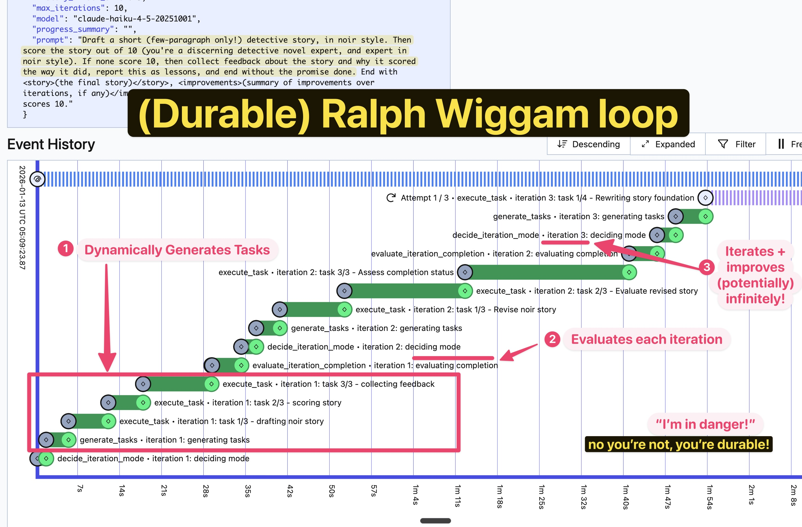

# temporal-ralph-wiggum

Temporal workflow implementing the **Ralph Wiggum loop** - an autonomous AI coding technique (named after the Simpsons character) where an AI agent is repeatedly fed the same prompt in a continuous loop until task completion.



The workflow stops when a completion phrase is detected or a max iteration limit is reached.

👉 **[See the core while loop that powers Ralph](https://github.com/steveandroulakis/temporal-ralph-wiggum/blob/main/src/ralph_wiggum/workflows.py#L68)** - the heart of the iteration logic.

**NOTE:** At present, this demo can only generate and manipulate text. It does not yet implement local file system access, nor unix command access. These features are planned for future versions.

## How it works
- Each iteration: `decide_iteration_mode` chooses single vs multi-task mode
- Single mode: execute one task directly
- Multi mode: generate tasks then execute each
- Completion evaluated once per iteration via `evaluate_iteration_completion`
- Promise tag `<promise>YOUR_PHRASE</promise>` emitted when done
- Workflow uses continue-as-new to avoid large history (progress_summary + history preserved)

## Requirements
- Python 3.9+
- Temporal server running locally
- `ANTHROPIC_API_KEY` set in the environment

## Install
```bash
pip install -e ".[dev]"
```

## Run
```bash
temporal server start-dev
python -m ralph_wiggum.worker
python run_workflow.py --prompt "Write a haiku about socks" --completion-promise "DONE"
```

## Example prompts

### Noir detective story example
Iterative creative writing with strict quality bar. The AI drafts a short noir detective story, scores it as a discerning expert, and only completes when it hits 10/10. Failed attempts collect feedback as "lessons" and retry—demonstrating how the loop refines output across iterations until quality criteria are met:
```bash
python run_workflow.py --prompt 'Draft a short (few-paragraph only!) detective story, in noir style. Then score the story out of 10 (you'\''re a discerning detective novel expert, and expert in noir style). If it doesn't score 10, then collect feedback about the story and why it scored the way it did, report this as lessons, and end without the promise done. End with <story>(the final story)</story>, <improvements>(summary of improvements over iterations, if any)</improvements> and <promise>DONE</promise> but ONLY when a story scores 10.' --completion-promise "DONE"
```

### Self-referential loop example
This prompt demonstrates the loop's iterative refinement capability. It asks the AI to write a poem about the Ralph Wiggum technique itself, then score it against strict criteria (exactly 4 lines = 10/10). If the poem doesn't meet the bar, the loop collects feedback as "lessons learned" and retries in the next iteration—showing how the workflow persists progress and refines output until success or max iterations:
```bash
python run_workflow.py --prompt "The 'Ralph Wiggum loop' (named after a Simpsons character) is an autonomous AI coding technique where an AI agent is repeatedly fed the same prompt in a continuous loop until a task is complete, with progress persisting in files and git history rather than the context window. Draft one poem (4 lines) about this concept, and link it to Ralph the character himself. Then score the poem out of 10 (you are a poetry expert and very discerning judge and want the poem to be clear and to capture the vibe of the topic at hand). NOTE: ONLY a poem with 4 lines scores 10, ensure you validate this. If the poem doesn't score 10, then collect feedback about the poem and why it scored the way it did, report this as lessons, and end without the promise done. End with <poem>(the final poem)</poem> and <promise>DONE</promise> only when a poem scores 10." --completion-promise "DONE"
```

### Terrible Cake Baking Instructions example (max-iterations)
This prompt will likely never reach completion, demonstrating the max-iterations cutoff. The AI is tasked with generating cake baking instructions that are intentionally poor. Each iteration will try to improve it, but since max iterations is 2, there isn't much chance of success:
```bash
python run_workflow.py --prompt "Describe making a chocolate cake in steps. You're a terrible baker and will be simple with it. Score the method out of 10 (as an expert baker), and if under 10 out of 10 (you are a cake baker), gather feedback on what to improve. Return format will be: <improvements>(summary of improvements over iterations, if any)</improvements> and <promise>DONE</promise> but ONLY when a cake recipe scores at least 10 out of 10." --completion-promise "DONE" --max-iterations 2
```

## CLI options
```bash
python run_workflow.py --help
```

## Tests
```bash
pytest tests/
```

## Project layout
- `src/ralph_wiggum/workflows.py` - RalphWorkflow (iteration-decision loop, continue-as-new)
- `src/ralph_wiggum/activities.py` - decide_iteration_mode, generate_tasks, execute_task, evaluate_iteration_completion
- `src/ralph_wiggum/models.py` - dataclass inputs/outputs for activities
- `src/ralph_wiggum/worker.py` - Temporal worker (task queue: `ralph-wiggum-queue`)
- `run_workflow.py` - CLI runner
